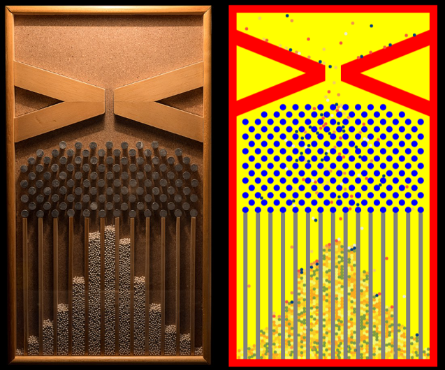

# Galton Board

The **Galton board**, also known as the *Galton box*, *quincunx*, or *bean machine*, is a device invented by Sir Francis Galton to demonstrate the central limit theorem. Specifically, it illustrates that with a sufficient sample size, the binomial distribution approaches a normal distribution. This device has also provided insights into the concept of regression to the mean, often referred to as "reversion to mediocrity".

## Description

The Galton board is designed as a vertical board furnished with interleaved rows of pegs. When beads are released from the top and the apparatus is maintained level, they deflect either to the left or the right upon colliding with the pegs. Eventually, these beads settle in bins at the bottom, and the accumulated beads form columns whose heights closely resemble a bell curve.

Interestingly, by superimposing Pascal's triangle onto the pins, one can discern the diverse paths that a bead might follow to reach each specific bin.


## Online Demonstration

You can view the functioning of the Galton board online at [phitter.io/galton-board](https://phitter.io/galton-board).

## References

All information is sourced from [Galton Board](https://en.wikipedia.org/wiki/Galton_board).



## Running the Project with Vite and Vue

To run the project using Vite and Vue, follow these steps:

### Prerequisites

Ensure you have [Node.js](https://nodejs.org/) and [npm](https://www.npmjs.com/) (Node Package Manager) installed on your system.

### Setup

1. **Clone the Repository**:
    ```bash
    git clone https://github.com/phitterio/galton-board.git
    cd https://github.com/phitterio/galton-board.git
    ```

2. **Install Dependencies**:
   Make sure you are in the root directory of your project, then run:
    ```bash
    npm install
    ```

3. **Start the Development Server with Vite**:
    ```bash
    npm run dev
    ```